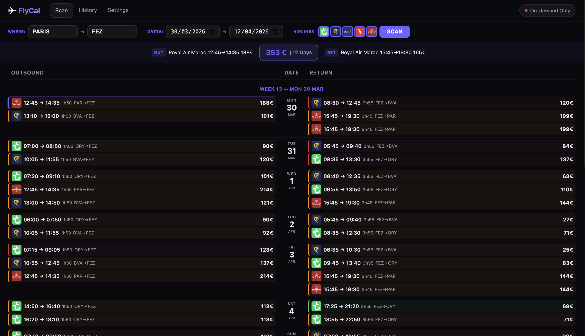

<p align="center">
  
</p>

<p align="center">
  <strong>Flights Planner</strong>
</p>

<p align="center">
  
  
  
  
  
</p>

<p align="center">
  <em>A self-hosted flight price planner with a visual calendar interface, automatic crawling, and price history tracking.</em><br>
  <em>Scrapes airline websites, stores historical prices, and presents results in a dark-mode Liquid Glass UI.</em>
</p>

---

## 📚 Table of Contents

- [🖥️ Screenshot](#-screenshot)
- [✨ Key Features](#-key-features)
- [⚡ Quick Start](#-quick-start)
- [🚀 Production Deployment](#-production-deployment)
- [⚙️ Configuration](#-configuration)
- [🏗️ Architecture](#-architecture)
- [🛠️ Technologies](#-technologies)
- [🐛 Troubleshooting](#-troubleshooting)
- [📄 License](#-license)

## 🖥️ Screenshot



## ✨ Key Features

- 🗓️ **Visual Calendar Grid** — Outbound and return flights aligned side-by-side per day, grouped by week
- 🔍 **Multi-Airline Scan** — Scrapes Transavia, Ryanair, Air France, and Air Arabia simultaneously
- 📊 **Price History** — Tracks price changes over time with trend indicators (↑↓)
- 🤖 **Automatic Crawler** — Scheduled runs at 7:00 and 22:00 with configurable email alerts
- 🎯 **Smart Color Coding** — Flights color-coded by time slots (green/orange/red) and price proximity
- 📧 **Email Notifications** — Receive daily recap of best prices via SMTP
- 🔄 **Search History** — Review and reuse past searches with compact flight previews
- 🌙 **Liquid Glass Dark UI** — Modern dark-mode interface with glassmorphism design
- 🐳 **Docker Deployment** — Single-command production deployment with Caddy HTTPS

## ⚡ Quick Start

```bash
git clone https://github.com/your-username/flycal.git
cd flycal
chmod +x start.sh
./start.sh
```

Open **https://localhost:4444** in your browser (accept the self-signed certificate).

API documentation: **https://localhost:4444/api/docs**

## 🚀 Production Deployment

### Prerequisites

- Docker and Docker Compose installed
- Port 4444 available (configurable)

### Deploy

```bash
# Clone and start
git clone https://github.com/your-username/flycal.git
cd flycal
./start.sh
```

### Custom Port

```bash
FLYCAL_PORT=8443 docker compose up --build -d
```

### Manual Start (without script)

```bash
docker compose up --build -d
```

### Update

```bash
git pull
docker compose up --build -d
```

Data is persisted in `./data/` (SQLite database, airline logos).

## ⚙️ Configuration

### Environment Variables

| Variable | Description | Default |
|----------|-------------|---------|
| `FLYCAL_PORT` | External HTTPS port | `4444` |
| `TZ` | Timezone for scheduler | `Europe/Paris` |

### In-App Settings

| Setting | Description |
|---------|-------------|
| **Reference Price** | Ideal flight price for color coding |
| **Airlines** | Add/remove airlines, set fixed fees and percentage fees, upload logos |
| **Time Slots** | Define departure time windows with green/orange/red color coding |
| **Automatic Crawler** | Enable daily automatic scanning (7:00 and 22:00) |
| **Email Notifications** | SMTP configuration for daily price recaps |

### Supported Airlines

| Airline | Scraping Method |
|---------|----------------|
| Ryanair | REST API (JSON) |
| Transavia | Playwright + XHR interception |
| Air France | Playwright + XHR interception |
| Air Arabia | Playwright + DOM parsing |

Airlines are fully configurable via the Settings page.

## 🏗️ Architecture

```
flycal/
├── start.sh                  # One-command deployment script
├── docker-compose.yml        # Docker Compose configuration
├── Dockerfile                # Multi-stage build (Python + Caddy + Playwright)
├── Caddyfile                 # Reverse proxy with HTTPS
├── backend/
│   ├── main.py               # FastAPI app + APScheduler
│   ├── database.py           # SQLAlchemy models + init
│   ├── scheduler.py          # Cron jobs (7:00 / 22:00)
│   ├── email_service.py      # HTML email recap
│   ├── requirements.txt
│   ├── routers/
│   │   ├── flights.py        # Flight search + scraping orchestration
│   │   ├── searches.py       # Search history CRUD
│   │   ├── settings.py       # App settings management
│   │   ├── crawler.py        # Crawler status + controls
│   │   └── airlines.py       # Airlines CRUD + logo upload
│   └── scraper/
│       ├── base.py           # Abstract scraper base class
│       ├── ryanair.py        # Ryanair JSON API scraper
│       ├── transavia.py      # Transavia Playwright scraper
│       ├── airfrance.py      # Air France Playwright scraper
│       └── airarabia.py      # Air Arabia Playwright scraper
├── frontend/
│   ├── index.html            # Scan page (main calendar view)
│   ├── history.html          # Search history
│   ├── settings.html         # Settings page
│   ├── css/
│   │   ├── main.css          # Liquid Glass Dark Mode theme
│   │   └── calendar.css      # Calendar & flight grid styles
│   └── js/
│       ├── api.js            # API client
│       ├── app.js            # Main app controller
│       ├── calendar.js       # Flight color coding & duration helpers
│       └── settings.js       # Settings page logic
└── data/                     # Persisted data (bind mount)
    ├── db.sqlite             # SQLite database
    └── logos/                # Uploaded airline logos
```

### API Endpoints

| Method | Endpoint | Description |
|--------|----------|-------------|
| `POST` | `/api/flights/search` | Launch a new flight search |
| `GET` | `/api/flights/last` | Get results of the last search |
| `GET` | `/api/searches` | List all past searches |
| `GET/PUT` | `/api/settings` | Read/update app settings |
| `GET/POST` | `/api/crawler/status` | Crawler status and controls |
| `GET/POST/PUT/DELETE` | `/api/airlines` | Airlines CRUD |
| `GET` | `/api/health` | Health check |
| `GET` | `/api/docs` | Swagger UI |

## 🛠️ Technologies

- **Backend**: FastAPI, SQLAlchemy, APScheduler, Python 3.12
- **Scraping**: Playwright (Chromium headless), playwright-stealth, httpx, BeautifulSoup
- **Database**: SQLite
- **Frontend**: Vanilla HTML5/CSS3/JavaScript (no frameworks)
- **Reverse Proxy**: Caddy (auto-HTTPS with self-signed certificate)
- **Containerization**: Docker, Docker Compose
- **Email**: smtplib (SMTP/TLS)

## 🐛 Troubleshooting

| Issue | Solution |
|-------|----------|
| Certificate warning in browser | Expected — accept the self-signed certificate |
| Port 4444 already in use | Use `FLYCAL_PORT=8443 docker compose up --build -d` |
| Scraping fails for an airline | Check logs: `docker compose logs -f` — some airlines may block headless browsers |
| Database resets | Ensure `./data/` directory exists and is writable |
| Crawler not running | Enable it in Settings > Automatic Crawler, then check logs |
| Email not sending | Test SMTP connection in Settings > Email > Test SMTP |

## 📄 License

This project is distributed under the **MIT License**.

---

**FlyCal** — Flight Planner
